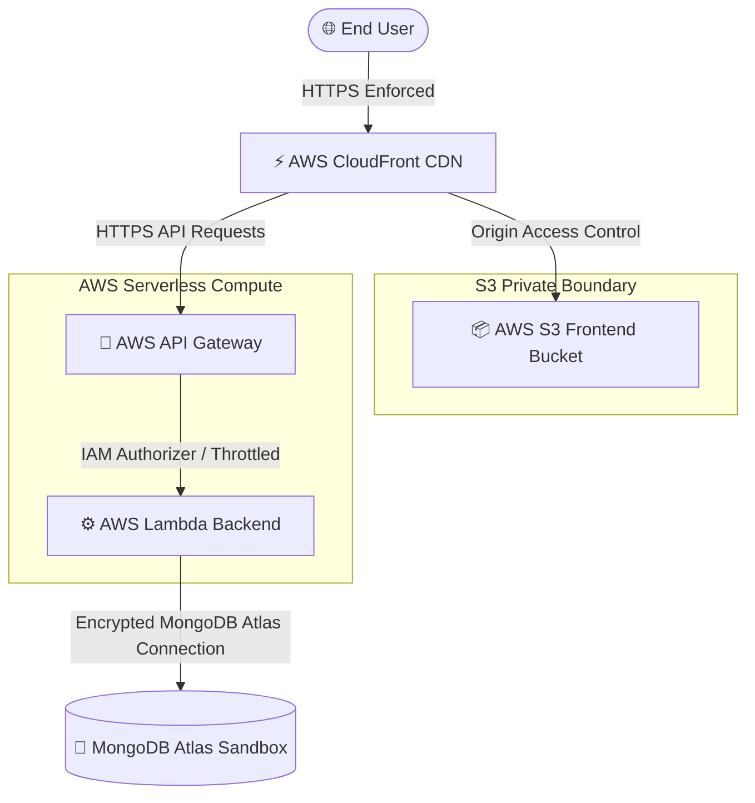

# 🛡️ AWS Zero-Cost Secure Serverless Architecture Blueprint
**Role:** Senior Security Architect, Cloud Architect, & DevSecOps Engineer  
**Objective:** Architect and deploy the full-stack Sophie Lamour application completely under the **AWS Free Tier ($0.00/month)** while enforcing **Enterprise Security Best Practices (Security by Design)**.

---

## 1. 🏗️ Secure Serverless Architecture
To prevent OS-level vulnerabilities, SSH credential leakage, and 12-month EC2 free tier expirations, we utilize a **100% Serverless, scale-to-zero model** that is **Always Free** up to 1M requests/month.



---

## 2. 🔐 Security by Design Implementations

### A. Static Asset Protection (CloudFront Origin Access Control - OAC)
*   **Vulnerability:** Public S3 buckets allow attackers to bypass the CDN, inspect file indices, or drive up direct S3 read costs.
*   **Remediation:** S3 bucket access is set to **private**. We configure **Origin Access Control (OAC)** in CloudFront. S3 only accepts requests that are signed and validated by CloudFront, meaning your raw frontend storage is completely hidden from the public internet.

### B. Credential-less Deployment (GitHub Actions OIDC integration)
*   **Vulnerability:** Storing long-lived `AWS_ACCESS_KEY_ID` and `AWS_SECRET_ACCESS_KEY` in GitHub Secrets risks credential exposure if GitHub accounts or repositories are compromised.
*   **Remediation:** We use **OpenID Connect (OIDC)**. We create an IAM Identity Provider in AWS for GitHub. GitHub Actions assumes a temporary, short-lived role (valid for 1 hour) dynamically for each push, eliminating all static keys from the codebase.

### C. Serverless API Gatekeeping (AWS API Gateway)
*   **Vulnerability:** Denial of Service (DDoS) and API abuse driving up computing costs.
*   **Remediation:** API Gateway acts as our shield:
    - Enforces **strict API Throttling** (e.g., max 50 requests/sec per user) to stay comfortably within the free tier.
    - Manages **CORS (Cross-Origin Resource Sharing)** strictly restricting requests to your custom domain.

### D. Advanced Security Headers & TLS Enforcements
*   We attach a **CloudFront Response Headers Policy** to inject security safeguards into every response:
    ```http
    Strict-Transport-Security: max-age=63072000; includeSubDomains; preload
    X-Frame-Options: DENY
    X-Content-Type-Options: nosniff
    Content-Security-Policy: default-src 'self'; script-src 'self' 'unsafe-inline'; style-src 'self' 'unsafe-inline'; img-src 'self' data: https:; connect-src 'self' https://api.sophielamourcoaching.com;
    ```

---

## 3. 🛠️ Code Adaptations for Serverless (AWS Lambda)

To make your FastAPI backend run inside AWS Lambda, we use **Mangum** (an ASGI adapter).

### Step 1: Install Mangum
Add `mangum==0.17.0` to your `backend/requirements.txt`.

### Step 2: Adapt `backend/server.py`
We wrap the FastAPI `app` with a Mangum handler:
```python
# Add at the bottom of backend/server.py
from mangum import Mangum
handler = Mangum(app)
```

---

## 4. 🤖 DevSecOps Automation: GitHub Actions workflows

### 🔐 Part A: Terraform IAM OIDC Setup (Run once on AWS)
This script creates the OIDC provider and the role assumed by GitHub Actions:

```json
{
  "Version": "2012-10-17",
  "Statement": [
    {
      "Effect": "Allow",
      "Principal": {
        "Federated": "arn:aws:iam::<YOUR_ACCOUNT_ID>:oidc-provider/token.actions.githubusercontent.com"
      },
      "Action": "sts:AssumeRoleWithWebIdentity",
      "Condition": {
        "StringEquals": {
          "token.actions.githubusercontent.com:aud": "sts.amazonaws.com"
        },
        "StringLike": {
          "token.actions.githubusercontent.com:sub": "repo:panky7/SOL:*"
        }
      }
    }
  ]
}
```

### 📦 Part B: GitHub Action Deployment Workflow (`.github/workflows/deploy.yml`)
Deploy frontend assets to S3 and Backend as a Lambda Function using **temporary OIDC roles**:

```yaml
name: 🛡️ Secure Serverless Deployment

on:
  push:
    branches:
      - main

permissions:
  id-token: write   # Required for requesting the JWT OIDC token
  contents: read    # Required for actions/checkout

jobs:
  deploy-frontend:
    runs-on: ubuntu-latest
    steps:
      - name: Checkout Code
        uses: actions/checkout@v4

      - name: Install Node & Build
        run: |
          cd frontend
          npm install
          npm run build

      - name: Configure AWS Credentials via OIDC
        uses: aws-actions/configure-aws-credentials@v4
        with:
          role-to-assume: arn:aws:iam::<YOUR_ACCOUNT_ID>:role/GitHubActionsDeploymentRole
          aws-region: us-east-1

      - name: Deploy Frontend to Private S3
        run: |
          aws s3 sync frontend/build/ s3://sophielamour-frontend --delete

      - name: Invalidate CloudFront Cache
        run: |
          aws cloudfront create-invalidation --distribution-id <YOUR_DISTRIBUTION_ID> --paths "/*"

  deploy-backend:
    runs-on: ubuntu-latest
    steps:
      - name: Checkout Code
        uses: actions/checkout@v4

      - name: Setup Python
        uses: actions/setup-python@v5
        with:
          python-version: '3.12'

      - name: Package Lambda Function
        run: |
          cd backend
          pip install -r requirements.txt -t lib/
          cp -r routes/ lib/
          cp server.py lib/
          cd lib
          zip -r ../lambda_function.zip .

      - name: Configure AWS Credentials via OIDC
        uses: aws-actions/configure-aws-credentials@v4
        with:
          role-to-assume: arn:aws:iam::<YOUR_ACCOUNT_ID>:role/GitHubActionsDeploymentRole
          aws-region: us-east-1

      - name: Deploy Backend to AWS Lambda
        run: |
          aws lambda update-function-code --function-name sophielamour-backend --zip-file fileb://backend/lambda_function.zip
```

---

> [!TIP]
> **Why this setup is 100% Free Forever:**
> 1. **AWS Lambda:** 1 Million executions/month free forever.
> 2. **AWS API Gateway:** 1 Million REST API calls/month free forever.
> 3. **AWS CloudFront:** 1 TB of transfer-out data free forever.
> 4. **AWS ACM:** Free SSL certificates forever.
> 5. **S3 Standard Storage:** 5 GB storage free (react build is ~15 MB).
> 6. **MongoDB Atlas:** 512 MB free sandbox forever.

---

### 🚀 Next Steps
Would you like me to go ahead and:
1. Create the `.github/workflows/deploy.yml` deployment script inside your repository?
2. Update the `backend/requirements.txt` and `backend/server.py` to support `mangum` serverless wrapping?
